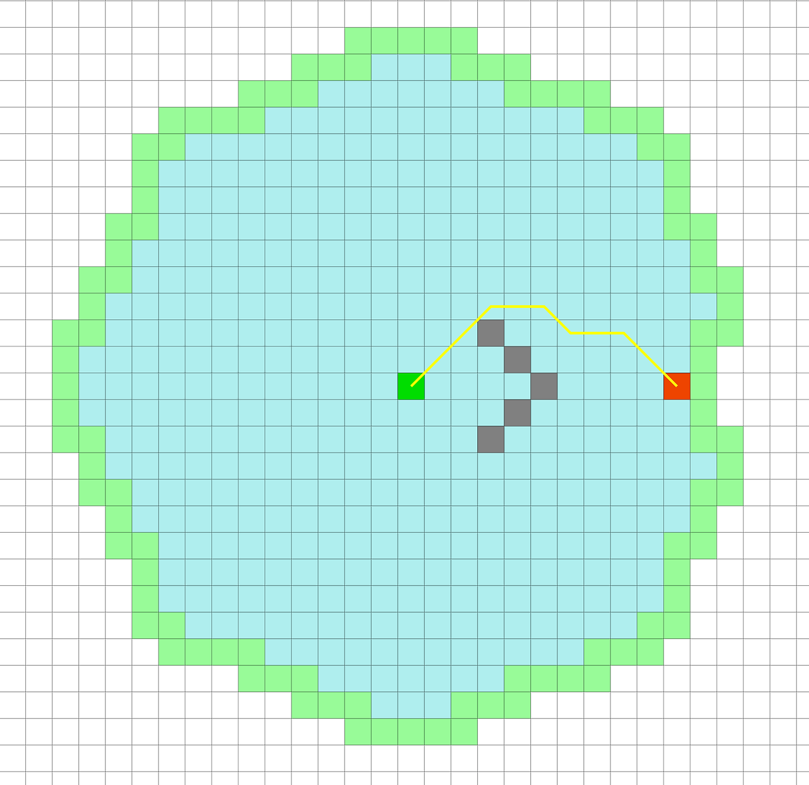
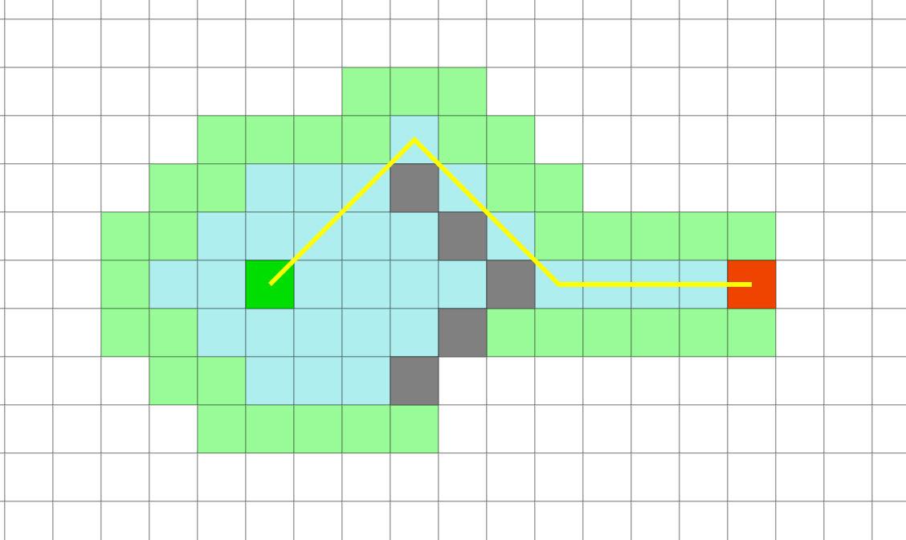
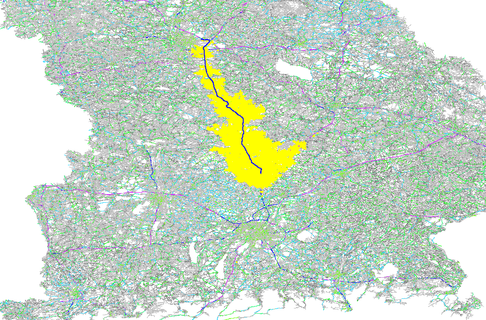
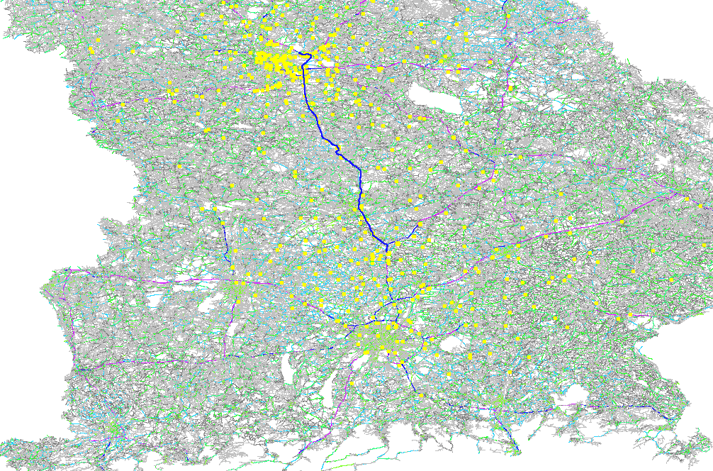
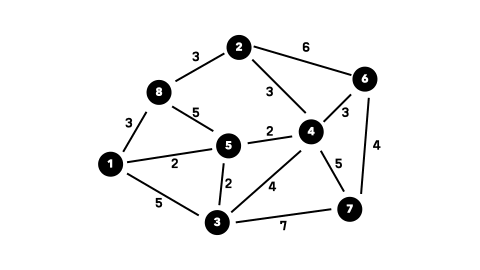

# 길찾기알고리즘

### 다익스트라 알고리즘

- 모든 경로에 대해 최단 경로를 찾는 알고리즘으로 목표 지점에 대한 정보가 없어도 우선순위 큐를 이용해 현재까지의 경로가 가장 짧은 정점을 계속해서 탐색하는 알고리즘

- 탐색 방식: 시작점에서 각 정점까지의 경로를 전부 탐색하며, 각 정점까지의 최단 거리를 계산
- 장점: 모든 정점에 대해 최단 경로를 보장
- 단점: 목표 지점이 있어도 모든 경로를 탐색하므로, 불필요한 경로 탐색이 발생

 

 

### A*알고리즘

- 다익스트라 알고리즘과 유사하나 목표 지점까지의 추정 거리(휴리스틱)을 활용하여 탐색하는 방식 즉 목표 지점에 가까운 경로를 우선적으로 탐색

- 탐색 방식: 시작점에서 목표 지점까지의 경로를 찾을 때, 현재까지의 실제 비용(g 값)과 목표까지의 예상 비용(h 값)을 합산한 f = g + h 값을 기준으로 탐색
- 장점: 목표 지점에 가까운 경로를 우선적으로 탐색하므로, 불필요한 경로 탐색을 줄일 수 있음
- 단점: 적절한 휴리스틱을 선택하지 못하면 성능이 저하되거나 다익스트라와 동일하게 작동함

 

 

(다익스트라 보다는 확실히 탐색양이 줄어들었지만 여전히 실생활에 사용하기에는 탐색량이 많다)

 

### CH 알고리즘

- 다익스트라나 A* 모두 출발지와 목적지가 전국 단위로 상당히 긴 경우 효율성의 문제가 발생하기에 이를 보완할 알고리즘이 필요

- CH 알고리즘은 도로망의 계층적 구조를 활용하여, 경로 탐색을 수행하는 방식으로 중요한 경로는 채택하고 덜 중요한 노드를 제거해 경로 탐색을 간소화하는 방식
- 노드 제거 과정에서 제거된 노드를 보완하기 위해 단축 경로(Shortcut Edges)를 추가
    - 이 때 이 단축 경로는 제거된 노드를 거치는 경로의 대체 경로 역할

- 동작 과정

    1. 랭크 부여(Node ordering): 각 정점에 랭크를 매김.
     
    2. Contraction(단축 경로 생성): 지름길 추가 & 비용 전처리
    3. 정점 선택: 랭크가 낮은 순서대로 정점을 뽑음. (u: 현재 정점, s와 t: u와 인접한 정점)
    4. 지름길 추가: 경로 P(s, u, t)가 s에서 t로 가는 최단 경로인 경우, dist(s, u) + dist(u, t) 값을 가진 지름길을 추가함.
    5. Hierarchies(계층을 두고 탐색): 
    u(출발지), v(도착지) 양쪽에서 시작하는 양방향 다익스트라로 랭크가 높은 쪽으로 탐색함.

 

### CCH 알고리즘

- CH 알고리즘으로도 실시간으로 빠르게 변하는 교통 상황의 경우 전처리를 다시 진행해야 하기에 이를 보완할 필요가 있었고 이에 등장한 알고리즘

 

### 예상질문

- 질문: "다익스트라 알고리즘과 A* 알고리즘의 차이점은 무엇이며, 각각 언제 사용하는 것이 적합한가?"
- 질문: A* 알고리즘에서 휴리스틱 함수의 선택이 결과에 미치는 영향은 무엇이며, 좋은 휴리스틱을 어떻게 정의할 수 있을까?
- 질문: 복잡한 도로망에서 경로 탐색 알고리즘의 성능을 개선하기 위한 방법은 무엇일까?
- 질문: 최단 경로와 최적 경로의 차이는 무엇이며, 각각 어떤 상황에서 더 유용할까?

### 출처

- https://newcodes.tistory.com/entry/%EC%B9%B4%EC%B9%B4%EC%98%A4%EB%A7%B5%EA%B3%BC-%ED%8B%B0%EB%A7%B5%EC%9D%B4-%EC%82%AC%EC%9A%A9%ED%95%98%EB%8A%94-%EC%95%8C%EA%B3%A0%EB%A6%AC%EC%A6%98-Customizable-Contraction-Hierarchies

