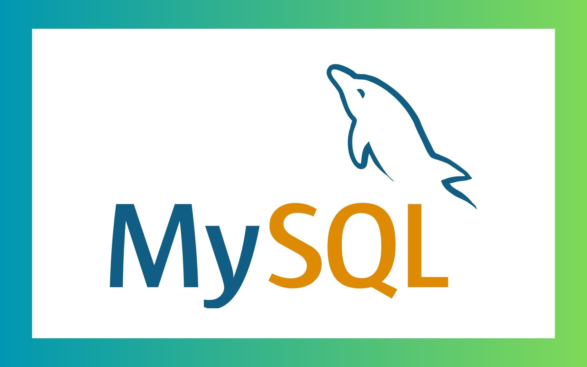

# MySQL 이란?
- 전 세계에서 가장 인기 있는 오픈소스 관계형 데이터베이스 중 하나
- 전자상거래 웹사이트, 소셜 미디어 및 애플리케이션에서 널리 사용
  - Linux-Apache-MySQL-PHP/Perl/Python(LAMP) 웹 애플리케이션 스택의 핵심 부분
- DB-Engines에서 전 세계에서 두 번째로 인기 있는 데이터베이스로 선정

## MySQL의 정의
- MySQL은 오픈소스 관계형 데이터베이스 관리 시스템
- 다른 관계형 데이터베이스와 마찬가지로 MySQL은 행과 열로 구성된 테이블에 데이터를 저장
- 사용자는 더 일반적으로 SQL이라고 하는 구조화된 쿼리 언어를 사용하여 데이터를 정의, 조작, 제어, 쿼리할 수 있음
- MySQL 공식 사이트 : https://www.mysql.com  

## SQL 사용
- 데이터 조작어(DML; Data Manipulation Language)
  - SELECT
  - INSERT
  - UPDATE
  - DELETE
- 데이터 정의어(DDL; Data Definition Language)
  - CREATE
  - ALTER
  - DROP
  - TRUNCATE
- 데이터 제어어(DCL; Data Control Language)
  - GRANT
  - REVOKE
- 트렌젝션 제어 명령어(TCL; Transaction Control Language)
  - COMMIT
  - ROLLBACK
  - SAVEPOINT
  - SET TRANSACTION

## MySQL의 이점
- 고가용성
  - MySQL 고가용성(HA)은 실패 없이 오랜 시간 작동하는 데이터베이스 엔진 기능을 의미
  - HA 설정은 사용자의 가용성 요구사항에 따라 복잡하며, 데이터 복제와 장애 복구 메커니즘 등이 필요
- 보안
  - MySQL 보안에는 데이터 보호와 관련된 다양한 요소가 있으며, 데이터 중복과 비밀번호 관리, 권한 설정 등이 포함
- 백업 및 복원
  - MySQL은 mysqldump, 바이너리 로그, 복제 등을 통해 데이터를 백업하고 복원할 수 있음
- 유연성
  - MySQL은 데이터베이스 구조를 수정해도 기존 애플리케이션에 영향을 주지 않으며, 필요에 따라 테이블과 데이터를 유연하게 조작할 수 있습니다.
- 사용 편의성
  - SQL을 통해 복잡한 쿼리를 쉽게 실행할 수 있어 초보자도 직관적으로 MySQL 데이터베이스를 사용할 수 있습니다.
- 성능
  - MySQL은 성능 최적화를 위한 다양한 기능과 조정 옵션을 제공하여 고성능 애플리케이션 개발을 지원
  - 쿼리 최적화와 성능 튜닝을 통해 시스템의 효율을 극대화 가능  

## 예시 질문
### SQL이란?

   
 예비 답안 보기 (👈 Click)

 

SQL(Structured Query Language)은 데이터베이스에서 데이터를 정의, 조작, 제어하고 쿼리하는 표준 언어입니다. 데이터를 삽입하거나 업데이트, 삭제, 조회하는 DML, 테이블과 같은 데이터 구조를 관리하는 DDL, 사용자 권한을 제어하는 DCL, 트랜잭션을 관리하는 TCL 등 다양한 명령어 집합을 제공합니다.

### MySQL의 이점은?

   
 예비 답안 보기 (👈 Click)

 

MySQL은 고가용성, 보안, 백업 및 복원, 유연성, 사용 편의성, 성능 등 여러 가지 이점을 제공합니다. 고가용성과 복구 메커니즘으로 안정적인 운영을 보장하며, SQL을 통한 데이터 조작이 쉬워 다양한 규모의 애플리케이션에서 사용하기 좋습니다.

## 참고
- Google Cloud : MySQL이란 무엇인가요? - https://cloud.google.com/mysql?hl=ko