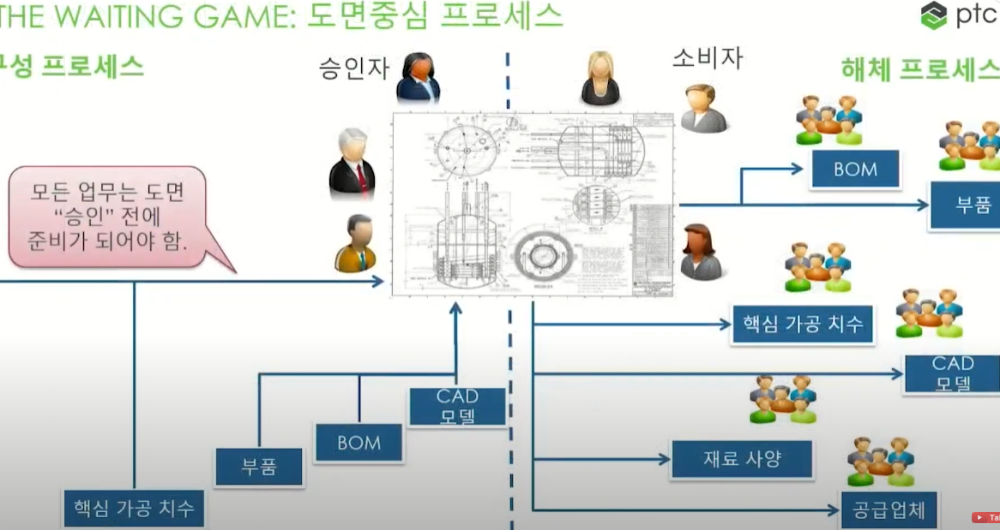
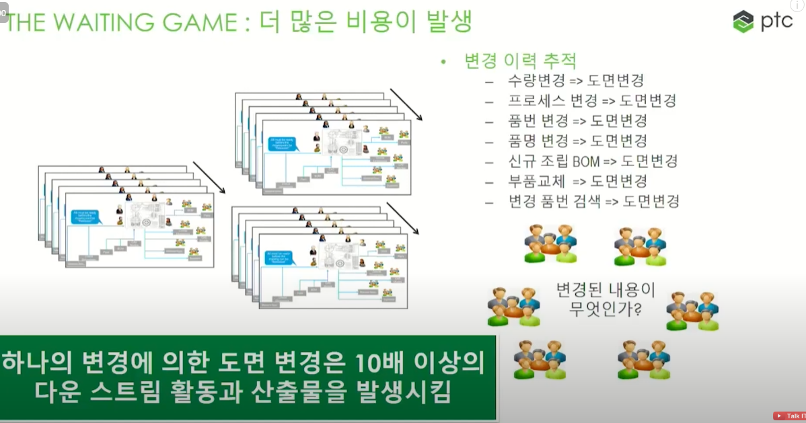

# 디지털 BOM

### 디지털 BOM 이란

-  전통적인 BOM을 디지털화하여 제품의 수명주기 동안 발생하는 모든 데이터를 체계적으로 관리하는 시스템

### 기존의 전통적 BOM의 문제점

### 주요 특징

#### 전통적 BOM과 차이점

- 전통적 BOM: 종이 기반 또는 간단한 전자 파일(Excel, Word 등)로 제품의 구성 부품과 자재 리스트를 관리하는 방식. 수작업으로 관리되기 때문에 정보의 일관성과 실시간 반영이 어렵다.

- 디지털 BOM: 모든 BOM 데이터를 중앙에서 디지털로 관리하며, 제품 설계부터 제조, 조립, 유지보수 단계까지 실시간으로 반영됨. 이는 변경 사항이나 오류를 빠르게 처리할 수 있게 해주며, 다양한 부서 간 협업을 더욱 원활하게 함

#### 주요 장점

- 생산성 향상: 설계 변경이 실시간으로 반영되어 생산 중단 없이 변경 사항이 적용되므로, 전체 공정 속도가 개선됨.
- 품질 향상: 부품 정보와 자재 명세가 정확하게 관리되기 때문에 품질 관리에 용이하며, 오류가 줄어듦.
- 비용 절감: 정확한 자재 정보와 재고 관리가 가능해지므로 불필요한 비용이 발생하지 않으며, 구매 프로세스를 최적화 가능.
- 협업 강화: 여러 부서가 동일한 BOM 데이터를 기반으로 실시간 협업을 할 수 있어, 의사소통 오류나 중복 작업을 줄일 수 있음.
 

### 예상질문 

질문: 디지털 BOM이 제조 공정에 미치는 영향은 무엇인가요?

   
 예비 답안 보기 (👈 Click)

   답변: 디지털 BOM은 제조 공정에서 부품을 정확하게 관리하고, 설계 변경 사항을 실시간으로 반영할 수 있어 오류를 줄이고 생산 효율성을 극대화할 수 있습니다. 예를 들어, 부품이 부족하거나 잘못 주문되는 문제를 방지하고, 정확한 데이터를 기반으로 생산 계획을 세울 수 있습니다. 또한, PLM 시스템과 ERP 시스템을 통합해 자재 관리와 재고 관리를 자동화할 수 있습니다.

 
질문: 디지털 BOM을 도입할 때 고려해야 할 요소는 무엇인가요?

   
 예비 답안 보기 (👈 Click)

   답변: 디지털 BOM을 도입할 때는 소프트웨어의 기능, 확장성, 그리고 다른 시스템과의 통합 가능성을 고려해야 합니다. 예를 들어, PLM, ERP, MES 시스템과의 원활한 통합이 중요하며, 제품 복잡성에 맞춰 다양한 부품과 자재 정보를 쉽게 관리할 수 있는지 확인해야 합니다. 또한 사용자 편의성도 고려해 각 부서가 손쉽게 접근하고 활용할 수 있어야 합니다.

### 출처

- https://blog.naver.com/edblab

