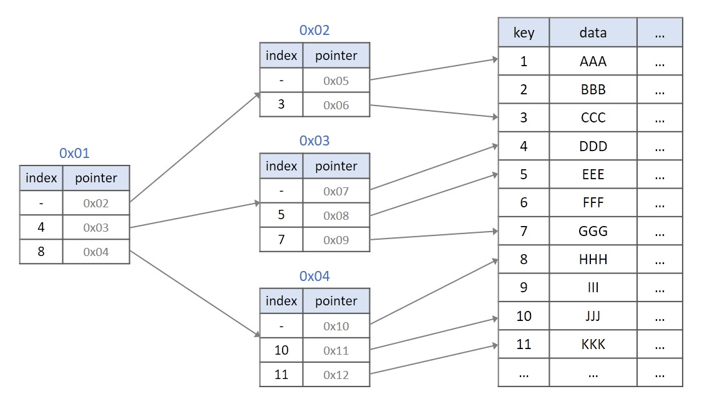
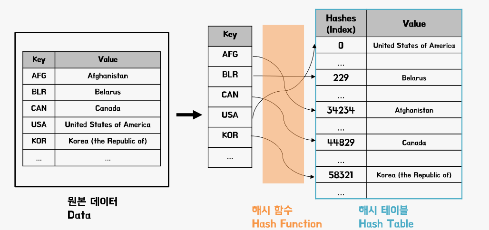
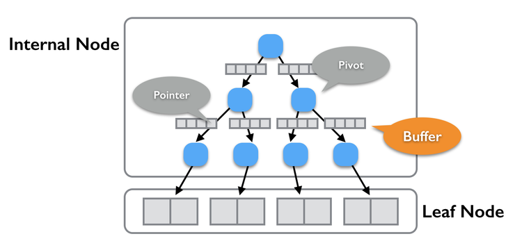
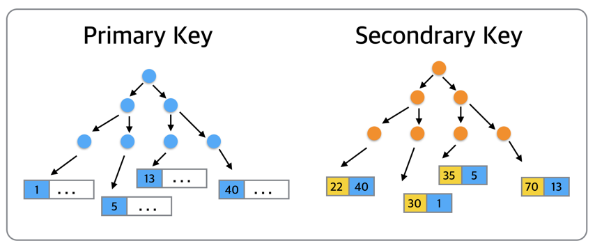

# 인덱스 (Index)
> 데이터베이스의 **인덱스**에 대해 알아보자.  
> 인덱싱의 의미와 종류, 타입 종류, 인덱싱 설계 시 고려할 점을 정리해본다.

## 인덱스의 개념
데이터베이스에서 테이블의 동작속도(조회)를 높여주는 자료구조이다.  
책의 목차나 사전의 'ㄱ', 'ㄴ'으로 시작하는 단어 구분 등이 대표적인 인덱싱이라고 할 수 있다.  
Full Table Scan을 방지하기 위해 성능 향상 및 최적화 용도로 사용하지만, 의외로 삽입,수정,삭제 연산은 속도가 저하 된다.

### Full Table Scan
DB 테이블의 모든 데이터를 확인하는 경우로 시간 복잡도가 최악 O(n)으로 치닫는다.  
이러한 경우를 방지하기 위해 최적화 기술을 사용하고, 대표적인 것이 인덱스이다.  
인덱스 사용 유무에 따라 0.1초가 10초가 되기도 한다.

### 인덱스의 특징
- SELECT 속도를 크게 향상
- 인덱스 생성 시 DB 크기의 약 10% 추가 공간이 필요하고, 시간이 조금 걸린다.
- INSERT, UPDATE, DELETE 등 데이터 변경 쿼리가 잦으면 오히려 성능이 악화될 수 있다.

## 인덱스의 종류

### 1) B-Tree 인덱스
- MySQL의 스토리지 엔진인 InnoDB에 적용 된 알고리즘으로, 기존 값을 변경하지 않고 활용해 인덱싱한다.
- B-Tree는 최상위 루트 노드, 중간 브랜치 노드, 최하위로 리프 노드의 트리 구조이다.
- 최대 장점은 어떤 데이터를 조회하든지 조회 과정의 길이와 비용이 비슷하다. - O(logN)
- 단, 데이터 갯수가 적은 테이블의 단순 조회는 속도가 느린 편이다. 

### 2) Hash 인덱스
- Redis 등의 인메모리 DB에 사용되는 알고리즘이다. 
- 값을 해시 값으로 변환해서 인덱싱한다.
- 검색 속도가 매우 빠르지만, 정렬되어 있지 않고 범위 조회는 느리다.

### 3) Fractal-Tree 인덱스
- TokuDB 등에서 B-Tree의 단점을 보완하기 위해 고안된 알고리즘이다.
- 값을 변경하지 않고 인덱싱 하는 점은 비슷하지만, 버퍼를 이용해서 데이터의 저장과 삭제 비용을 줄일 수 있게 설계되었다.

## 인덱스 타입

### 클러스터 인덱스(Clustered Index)
- 테이블의 데이터를 정렬하는 인덱스
- 테이블 당 하나만 지정 가능하며, InnoDB의 **Primary Key**
- 인덱스의 리프 페이지가 곧 데이터이기 때문에, 인덱스 자체에 데이터가 포함되어 있다고 볼 수 있음
- 보조 인덱스보다 검색 속도가 빠르다, 입력/수정/삭제는 더 느림

### 보조 인덱스(Secondary Index / Non-Clustered Index)
- 클러스터 인덱스와 달리, 데이터의 물리적 순서와는 무관하게 별도의 인덱스 구조로 데이터 위치를 참조
- 데이터를 자동 정렬하하지 않음
- 여러 개의 생성 가능하며, InnoDB의 **Unique** 키워드가 대표적
- 클러스터 인덱스보다 검색은 느리지만, 입력/수정/삭제는 덜 느림

## 인덱스 설계
### 1. 효율적인 인덱스 사용
- WHERE 절에 자주 사용되는 열에 인덱스를 생성하면 검색 속도를 높일 수 있다.
- SELECT 절에 자주 등장하는 컬럼들을 인덱스로 조합하면 빠른 검색이 가능하다.
- JOIN 절에 사용되는 열에 인덱스를 설정하면 성능이 향상된다.
- ORDER BY 절에 사용되는 열은 클러스터형 인덱스를 사용하면 유리하다.
- 외래키는 자동으로 인덱스가 생성된다.

### 2. 인덱스 설계 시 피해야 할 사항
- 대용량 데이터가 자주 입력되는 경우, 클러스터형 인덱스는 부담이 될 수 있어 주의가 필요하다. 
- 중복도가 높은 열(예: 성별)에는 인덱스를 사용하지 않는 것이 좋다. 이는 검색 속도를 향상시키지 않으며, 오히려 Table Full Scan이 더 나을 수 있다. 
- 자주 사용되지 않는 인덱스는 성능 저하를 초래할 수 있다.

### 3. 인덱스 사용 시 주의할 점
- 데이터 변경 작업(삽입, 수정, 삭제)이 빈번하다면 인덱스가 성능에 영향을 줄 수 있다.
- 단일 테이블에 4~5개 이상의 인덱스를 사용하지 않는 것이 좋다.
- 검색할 데이터가 전체 데이터의 20% 이상이면 MySQL은 인덱스를 사용하지 않으며, 강제로 사용할 경우 성능 저하가 발생할 수 있다.
- 사용하지 않는 인덱스는 제거하여 성능을 개선할 수 있다.
- 클러스터형 인덱스는 테이블당 하나만 생성할 수 있다.

###  4. INDEX 사용의 손익분기점
- 전체 데이터의 10~15% 이하를 검색할 때 인덱스가 유리하며, 그 이상이면 풀스캔이 더 효율적일 수 있다.

## 예시 질의응답

### 인덱스란? 사용 시 주의할 점은?

   
 예비 답안 보기 (👈 Click)

 

인덱스는 데이터베이스에서 테이블의 조회 속도를 높이기 위해 사용하는 자료구조입니다. 책의 목차와 유사하게 데이터 검색 시간을 줄여줍니다.  
인덱스를 사용할 때는 INSERT, UPDATE, DELETE 등 데이터 변경 작업이 많을 경우 오히려 성능 저하가 발생할 수 있습니다. 또한, 데이터의 중복도가 높은 열에 인덱스를 사용하는 것은 효율적이지 않으므로 주의해야 합니다.

### 클러스터 인덱스와 보조 인덱스의 차이점은?

   
 예비 답안 보기 (👈 Click)

 

클러스터 인덱스는 테이블의 데이터 자체가 인덱스에 따라 물리적으로 정렬된 구조로, 테이블 당 하나만 생성할 수 있습니다.  
InnoDB의 **Primary Key**가 대표적이며, 인덱스의 리프 페이지가 실제 데이터이므로 검색 속도가 빠릅니다.  
반면, 보조 인덱스는 데이터의 물리적 순서와 무관하게 별도의 인덱스 구조로 데이터 위치를 참조합니다.  
여러 개의 생성이 가능하며, InnoDB의 **Unique** 키워드가 대표적입니다. 클러스터 인덱스보다 검색은 느리지만, 입력/수정/삭제 시 성능 저하가 적습니다.

## 레퍼런스
- [Inpa Dev - 인덱스 핵심 설계 & 사용문법](https://inpa.tistory.com/entry/MYSQL-%F0%9F%93%9A-%EC%9D%B8%EB%8D%B1%EC%8A%A4index-%ED%95%B5%EC%8B%AC-%EC%84%A4%EA%B3%84-%EC%82%AC%EC%9A%A9-%EB%AC%B8%EB%B2%95-%F0%9F%92%AF-%EC%B4%9D%EC%A0%95%EB%A6%AC#%ED%81%B4%EB%9F%AC%EC%8A%A4%ED%84%B0_%EC%9D%B8%EB%8D%B1%EC%8A%A4_primary_index)
- [Kakao tech - MySQL InnoDB의 Adptive Hash Index 활용](https://tech.kakao.com/posts/319)
- [[MySQL] - 인덱스 (INDEX) 정리 (동작 방식, 생성, 삭제, 설계)](https://rachel0115.tistory.com/entry/MySQL-%EC%9D%B8%EB%8D%B1%EC%8A%A4-INDEX-%EC%A0%95%EB%A6%AC-%EB%8F%99%EC%9E%91-%EB%B0%A9%EC%8B%9D-%EC%83%9D%EC%84%B1-%EC%82%AD%EC%A0%9C-%EC%84%A4%EA%B3%84)

