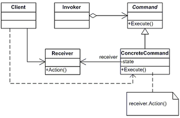

# 디자인패턴

### State 패턴

-  객체의 상태를 나타내는 클래스 집합과 그 상태에 따른 행동을 캡슐화하는 방식


#### 주요 특징
- 행동 변화: 객체의 상태가 바뀌면, 그에 따라 객체의 행동도 자동으로 바뀜
- 캡슐화: 상태별로 코드를 분리하여 캡슐화하므로, 상태에 따라 다른 코드가 필요할 때 if/else 또는 switch 문을 사용하지 않고도 쉽게 확장 가능
- 유지보수 용이: 새로운 상태를 추가할 때 기존 코드를 변경할 필요 없이 새로운 상태 클래스를 추가하면 되므로, 개방-폐쇄 원칙(OCP)을 만족.

<br/>



<br/>

#### 사용 목적:
- 복잡한 상태 전환 로직을 관리해야 하는 경우
- 상태가 자주 변경되고, 상태에 따라 객체의 동작이 달라지는 경우
- 코드의 가독성과 유지보수성을 높이고자 할 때


<br/>

#### 예시(기계직 생산관리):
- 설비 상태 관리
    - 설비가 작동을 시작하면, 상태는 "작동 중"이 되고, 이 상태에서는 특정 작업을 수행하거나 다른 명령을 받을 수 없음.
    - 설비가 대기 상태로 전환되면 "대기 중"으로 상태가 변경되며, 이제 새로운 작업을 대기하거나 다음 작업을 준비할 수 있게 됨.
    - 설비에 오류가 발생하면 상태는 "오류 발생"으로 바뀌고, 오류 처리를 위한 코드가 실행됨.

<br/>

```
# 상태 인터페이스 정의
class State:
    def handle(self, context):
        pass

# 구체적인 상태 클래스
class IdleState(State):
    def handle(self, context):
        print("장비가 대기 상태입니다.")
        # 대기 상태에서는 특정 작업을 기다리거나 설정 변경이 가능

class RunningState(State):
    def handle(self, context):
        print("장비가 작동 중입니다.")
        # 작동 중일 때는 다른 명령을 받지 않고 현재 작업을 수행

class MaintenanceState(State):
    def handle(self, context):
        print("장비가 점검 중입니다.")
        # 점검 상태에서는 유지 보수 또는 점검을 수행

class ErrorState(State):
    def handle(self, context):
        print("장비에 오류가 발생했습니다.")
        # 오류 상태에서는 즉각적으로 오류를 처리하거나 보고

# Context 클래스
class Equipment:
    def __init__(self):
        self.state = IdleState()  # 초기 상태는 대기

    def set_state(self, state):
        self.state = state

    def request(self):
        self.state.handle(self)

# 장비의 상태 변화 시뮬레이션
equipment = Equipment()

equipment.request()  # 장비가 대기 상태
equipment.set_state(RunningState())  # 상태 변경
equipment.request()  # 장비가 작동 중
equipment.set_state(ErrorState())  # 상태 변경
equipment.request()  # 장비에 오류 발생

```
<br/>

### 커맨드 패턴

-  특정한 작업을 수행하는 객체와 그 작업을 요청하는 객체 간의 관계를 느슨하게 결합하는 패턴


#### 주요 특징
- Command 객체: 명령을 추상화한 객체. 각 명령은 execute() 메서드를 통해 호출되며, 해당 명령을 수행할 동작이나 로직을 담음. 이 객체는 구체적인 실행 내용을 캡슐화하여, 호출자가 어떻게 명령을 처리하는지에 대해 알 필요가 없도록 만듬.

- Invoker(호출자): 명령을 요청하고 실행하는 역할을 담당. Invoker는 Command 객체의 execute() 메서드만 호출하며, 실제로 해당 명령이 어떻게 수행되는지는 신경 쓰지 않음.

- Receiver(수신자): 명령을 실제로 처리하는 객체. 이 객체는 Command가 전달한 요청을 받아 실행하며, 호출자(Invoker)와 달리 구체적인 동작을 수행

<br/>



<br/>

#### 사용 목적:
- 요청과 실행의 분리: 호출자와 수신자의 결합도를 낮추어, 명령을 쉽게 추가, 수정, 삭제할 수 있음.
- 재사용성과 유연성: Command 객체를 저장하거나, 명령 이력을 관리하고, 실행 취소(Undo) 기능 등을 구현할 때 유용.
- 확장성: 새로운 명령을 추가할 때 기존 코드를 변경하지 않고 새로운 명령 클래스만 추가하면 됨.


<br/>

#### 예시(기계직 생산관리):

```
# Command 인터페이스 정의
class Command:
    def execute(self):
        pass

# ConcreteCommand 클래스 정의
class StartCommand(Command):
    def __init__(self, machine):
        self.machine = machine

    def execute(self):
        self.machine.start()

class StopCommand(Command):
    def __init__(self, machine):
        self.machine = machine

    def execute(self):
        self.machine.stop()

class InspectCommand(Command):
    def __init__(self, machine):
        self.machine = machine

    def execute(self):
        self.machine.inspect()

# Receiver 클래스 정의 (실제 기계)
class Machine:
    def start(self):
        print("기계 가동 중...")

    def stop(self):
        print("기계 정지 중...")

    def inspect(self):
        print("기계 점검 중...")

# Invoker 클래스 정의 (명령 실행)
class MachineController:
    def __init__(self):
        self.command = None

    def set_command(self, command):
        self.command = command

    def execute_command(self):
        if self.command:
            self.command.execute()

# 클라이언트 코드
machine = Machine()
controller = MachineController()

# StartCommand 실행
start_command = StartCommand(machine)
controller.set_command(start_command)
controller.execute_command()  # 출력: 기계 가동 중...

# StopCommand 실행
stop_command = StopCommand(machine)
controller.set_command(stop_command)
controller.execute_command()  # 출력: 기계 정지 중...

# InspectCommand 실행
inspect_command = InspectCommand(machine)
controller.set_command(inspect_command)
controller.execute_command()  # 출력: 기계 점검 중...
```

### 출처

- https://johngrib.github.io/wiki/pattern/state/
- https://shong-studio.tistory.com/entry/%EB%94%94%EC%9E%90%EC%9D%B8-%ED%8C%A8%ED%84%B4-State-Pattern-%EC%83%81%ED%83%9C-%ED%8C%A8%ED%84%B4
- https://studyandwrite.tistory.com/576

