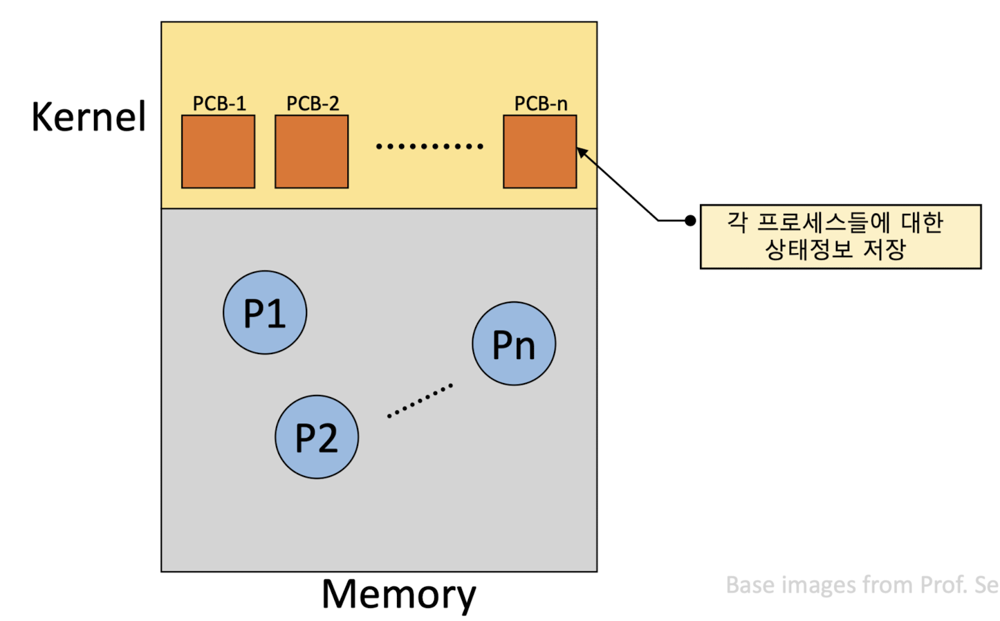
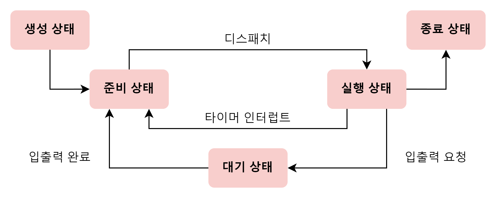

# Process&Thread

### 프로세스

- 실행 중인 프로그램(프로그램이 메모리에 적재되고 실행)

  
    
- foreground process: 사용자가 보는 앞에서 실행되는 프로세스
- background process: 사용자가 보지 못하는 뒤편에서 실행되는 프로세스(e.g. 유닉스 데몬, 윈도우 서비스)

### 프로세스 제어 블록(PCB)

- 프로세스와 관련된 정보를 저장하는 자료구조(프로세스 생성시 같이 생성)
- 프로세스 ID, 레지스터 값, 프로세스 상태, CPU 스케줄링 정보, 메모리 관리 정보, 사용자 파일과 입출력 장치 목록 기록
- 커널 영역에 적재
    
    
    

### 프로세스의 메모리 영역

- 코드 영역(텍스트 영역)
    - 기계어로 이루어진 명령어 저장
    - 읽기 전용 공간
- 데이터 영역
    - 프로그램이 실행되는 동안 유지할 데이터가 저장되는 공간
    - e.g. 전역 변수
- 힙 영역
    - 프로그래머가 직접 할당할 수 있는 저장 공간
    - 메모리 할당 후 반환하지 않으면 메모리 누수가 발생함
- 스택 영역
    - 데이터를 일시적으로 저장하는 공간
    - e.g. 매개 변수, 지역 변수

### 프로세스 상태

- 생성 상태
    - 이제 막 메모리에 적재되어 PCB를 할당받은 상태
    - 실행할 준비가 완료되면 준비 상태가 될 수 있음
- 준비 상태
    - CPU를 제외한 모든 자원을 할당받은 상태
    - 차례가 되면 CPU를 받아 실행 상태가 될 수 있음(dispatch)
- 실행 상태
    - CPU를 할당받아 실행 중인 상태
    - 프로세스가 할당된 시간을 모두 사용하면 준비 상태로 돌아감
- 대기 상태
    - 입출력장치의 작업을 기다리는 상태
- 종료 상태
    - 프로세스가 종료된 상태
    - 운영체제는 PCB와 프로세스가 사용한 메모리를 정리함

### 스레드

- 프로세스를 구성하는 실행의 흐름 단위
- 하나의 프로세스는 최소 한 개 이상의 스레드를 가짐
- 프로세서(CPU) 활용의 기본 단위
- 구성 요소: 스레드 ID, 레지스터 set, 지역 데이터

### 멀티프로세스와 멀티스레드

- 멀티프로세스: 여러 프로세스를 동시에 실행하는 것
    - 장점: 독립된 메모리 공간으로 인한 안전성 확보
    - 단점: 자원 공유에 비효율적, 프로세스 생성 및 Context Switch 오버헤드가 큼
- 멀티스레드: 여러 스레드로 프로세스를 동시에 실행하는 것
    - 장점: 자원 공유로 인한 효율성 증가(커널 개입을 피할 수 있음), Context Switch에 효율적, 응답시간 단축
    - 단점: 하나의 스레드에 문제가 생기면 다른 스레드도 영향을 받을 수 있음, 공유 자원에 대한 동기화 작업 필요

### 질의 응답 예시

   
 프로세스와 스레드의 차이점은? (👈 Click)

- 프로세스는 실행 중인 프로그램으로 독립된 메모리 공간을 가집니다. 반면, 스레드는 프로세스의 실행 단위로, 프로세스의 자원을 공유하면서 동작합니다.

   
 프로세스의 메모리 구조를 설명해주세요. (👈 Click)

- 정적으로 할당되는 코드 영역, 데이터 영역이 있고, 동적으로 할당되는 스택 영역, 힙 영역이 있습니다.

   
 멀티스레드란? (👈 Click)

- 하나의 프로세스 내에서 여러 스레드가 동시에 작업을 수행하는 것

 

> 출처
> 
- 혼자 공부하는 컴퓨터구조+운영체제
- 운영체제 - 김덕수(한국기술교육대)
- [https://inpa.tistory.com/entry/👩‍💻-multi-process-multi-thread](https://inpa.tistory.com/entry/%F0%9F%91%A9%E2%80%8D%F0%9F%92%BB-multi-process-multi-thread)