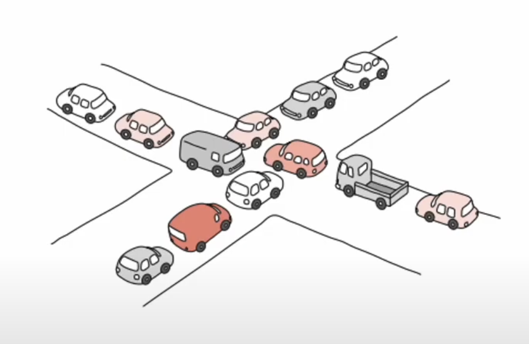
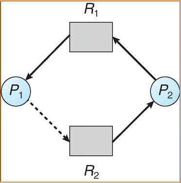

# 교착 상태(Deadlock)

- 두 개 이상의 작업이 서로의 작업이 끝나기만을 기다리며 다음 자원을 무한히 기다리게 되는 상태
- 시스템적으로 한정된 자원을 여러 곳에서 사용하려고 할 때 발생

### Deadlock 발생 조건(4가지 조건을 모두 성립해야 데드락 발생)

1. 상호 배제(Mutual exclusion)
   - 한 번에 하나의 프로세스만 자원 이용 가능
2. 비선점(No preemption)
   - 할당된 자원을 강제로 빼앗지 못함
3. 점유 대기(Hold and wait)
   - 자원을 할당받은 상태에서 다른 자원의 할당을 기다리는 상태
4. 순환 대기(Circular wait)
   - 자원을 기다리는 프로세스 간에 사이클 형성

### Deadlock 해결 방법

1. 예방(Deadlock prevention)
   - 4개의 Deadlock 발생 필요 조건 중 하나를 제거하는 방법
   - 심각한 자원 낭비가 발생하는 단점
2. 회피(Deadlock avoidance)
   - Deadlock 상태가 될 가능성이 있는 자원 할당 요청을 보류해, 항상 정상적으로 모든 프로세스가 종료 가능한 상태로 유지
   - e.g.) Dijkstra’s algorithm(은행원 알고리즘), Habermann’s algorithm
   - 시스템을 항상 감시해야하며 낮은 자원 활용의 단점
3. 탐지 및 복구(Deadlock detection and recovery)
   - Deadlock 방지를 위한 사전 작업을 하지 않고, 주기적으로 Deadlock 발생을 확인한다.
   - Deadlock 발생 시 Recovery 과정 필요
   - Deadlock Recovery 방법으로는 Process termination, Resource preemption이 존재
4. 무시
   - Deadlock에 아무런 대비책 없이 발생하도록 내버려 두는 방법
   - e.g) 타조(Ostrich) 알고리즘

### 예제 질문

   
 Deadlock이란 (👈 Click)

- 두 개 이상의 작업이 서로의 작업이 끝나기 만을 기다리며 다음 자원을 무한히 기다리게 되는 상태

   
 교착 상태 발생 조건 중 상호 배제에 대해 설명하세요. (👈 Click)

- 한 번에 하나의 프로세스만 자원 이용이 가능한 조건

 

> 참고 자료
> 

운영체제 - 김덕수 교수

혼자서 공부하는 컴퓨터 구조 + 운영체제

[https://superohinsung.tistory.com/73](https://superohinsung.tistory.com/73)

[https://velog.io/@zioo/Deadlock교착-상태의-개념과-발생-원인](https://velog.io/@zioo/Deadlock%EA%B5%90%EC%B0%A9-%EC%83%81%ED%83%9C%EC%9D%98-%EA%B0%9C%EB%85%90%EA%B3%BC-%EB%B0%9C%EC%83%9D-%EC%9B%90%EC%9D%B8)

[https://gyoogle.dev/blog/computer-science/operating-system/DeadLock.html](https://gyoogle.dev/blog/computer-science/operating-system/DeadLock.html)