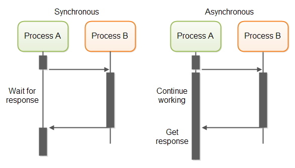
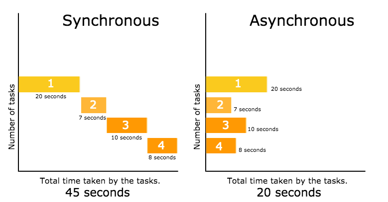
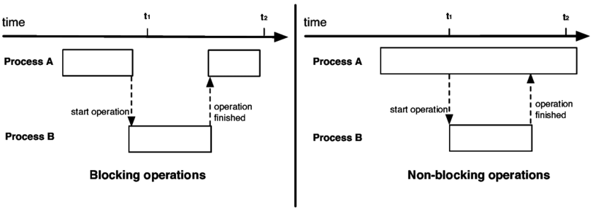
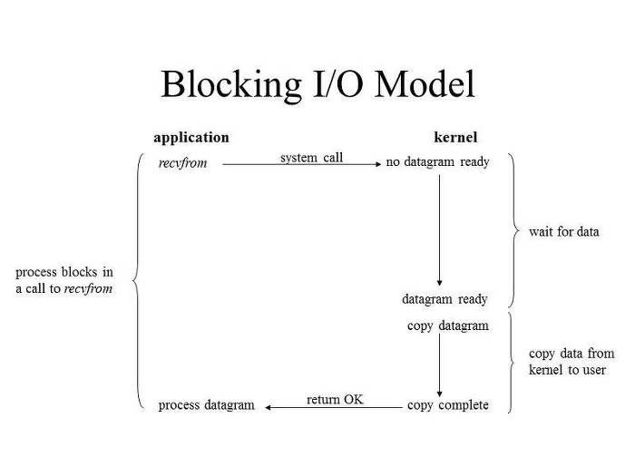
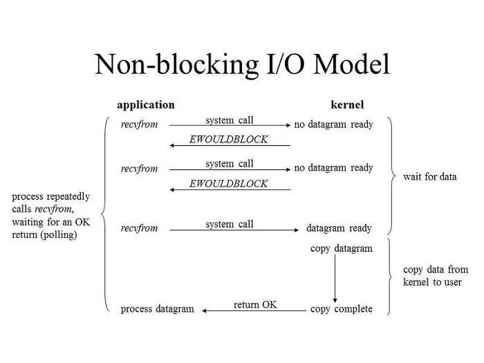
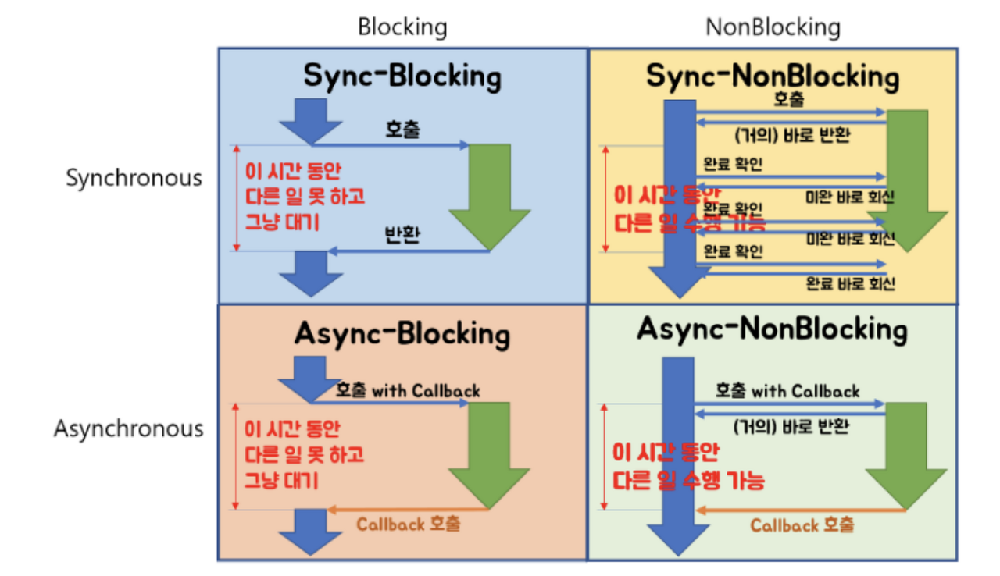

# 동기/비동기 & 블로킹/논블로킹

### 동기(Synchronous)

- 요청한 작업의 결과를 순차적으로 처리하는 것
- 요청과 결과가 직접적으로 연결
- 작업의 응답 순서가 지켜진다.
- 설계가 간단하고 직관적이지만, 결과가 주어질 때까지 대기해야 하는 단점이 있다.

### 비동기(Asynchronous)

- 요청한 작업의 결과를 신경쓰지 않고 다음 작업을 수행하는 것
- 요청과 결과가 분리
- 작업의 응답 순서가 지켜지지 않을 수 있다.
- 동기보다 복잡하지만, 자원을 효율적으로 사용할 수 있다.

---

### Blocking

- 호출된 함수가 자신의 작업을 완료하고 호출한 함수에게 제어권을 넘겨주는 것
- 다른 요청의 작업을 처리하기 위해 현재 작업을 Block
- (e.g.) I/O Blocking
    - 프로세스/스레드가 커널에게 I/O를 요청하는 함수(recvfrom) 호출
    - 커널 작업 완료 후 작업 결과 리턴
    
    
    

### Non-Blocking

- 호출된 함수가 제어권을 호출한 함수에게 바로 넘겨주는 것
- 다른 요청의 작업을 처리하며 현재 작업을 Non-Block
- (e.g.) I/O Non-Blocking
    - 프로세스/스레드가 커널에게 I/O를 요청하는 함수(recvfrom) 호출
    - 제어권은 곧바로 리턴 → 커널 작업 중에 프로세스/스레드는 자신의 작업 진행
    - 커널 작업이 완료되면 결과 리턴
    
    
    

---

### Sync-Blocking

- Synchronous + Blocking
- 호출하는 함수는 호출된 함수의 작업 완료/리턴을 받기 전까지 다른 일을 하지 않고 대기
- 다른 작업의 결과가 자신의 작업에 영향을 주는 경우에 활용

### Async-NonBlocking

- Asynchronous + Non-Blocking
- 호출하는 함수는 호출된 함수의 작업 완료/리턴을 기다리지 않고 다른 일을 수행
- 다른 작업의 결과가 자신의 작업에 영향을 주지 않는 경우 활용

### Sync-NonBlocking

- Synchronous + Non-blocking
- 호출하는 함수는 호출된 함수의 작업 완료/리턴을 주기적으로 확인하며 다른 일을 수행
- 다른 작업의 결과를 바로 처리해 작업을 순차대로 수행

### Async-Blocking

- Asynchronous + Blocking
- 호출하는 함수는 호출된 함수의 작업 완료/리턴을 기다리지 않지만, 호출된 함수가 자신의 작업이 끝날 때까지 제어권을 넘겨주지 않아 호출된 함수의 작업이 완료될 때까지 대기
- Sync-Blocking과 유사하게 동작하고 성능적으로 차이가 없다.

### 질의응답

   
 동기와 비동기의 차이점? (👈 Click)

요청 작업 결과를 신경써서 작업을 순차적으로 수행할지 아닌지에 대한 관점
 
동기: 간단함, 응답 순서 보장 / 비동기: 복잡함, 자원을 효율적으로 사용

   
 Blocking과 Non-Blocking의 차이점? (👈 Click)

현재 작업의 block(차단) 여부에 따라 다른 작업을 수행할 수 있는지에 대한 관점
 
Blocking: 호출된 함수가 제어권을 가짐 / Non-Blocking: 호출한 함수가 제어권을 가짐

 

> 출처
> 

[https://inpa.tistory.com/entry/👩‍💻-동기비동기-블로킹논블로킹-개념-정리](https://inpa.tistory.com/entry/%F0%9F%91%A9%E2%80%8D%F0%9F%92%BB-%EB%8F%99%EA%B8%B0%EB%B9%84%EB%8F%99%EA%B8%B0-%EB%B8%94%EB%A1%9C%ED%82%B9%EB%85%BC%EB%B8%94%EB%A1%9C%ED%82%B9-%EA%B0%9C%EB%85%90-%EC%A0%95%EB%A6%AC)
 
[https://dev-coco.tistory.com/46](https://dev-coco.tistory.com/46)
 
[https://steady-coding.tistory.com/531](https://steady-coding.tistory.com/531)
